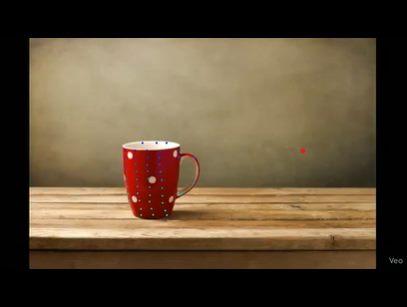
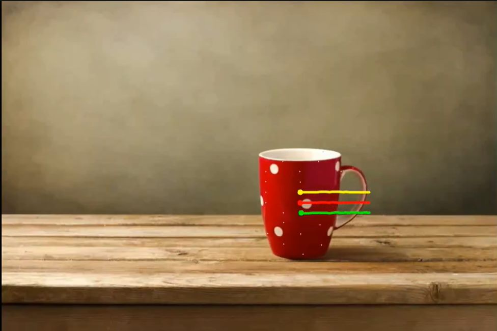
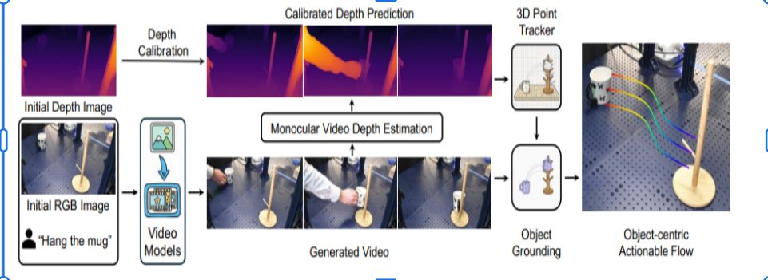
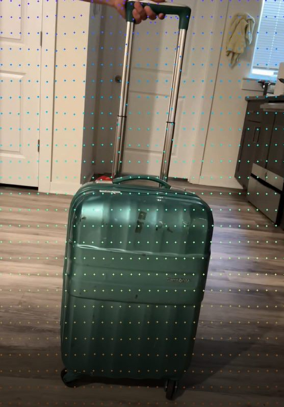
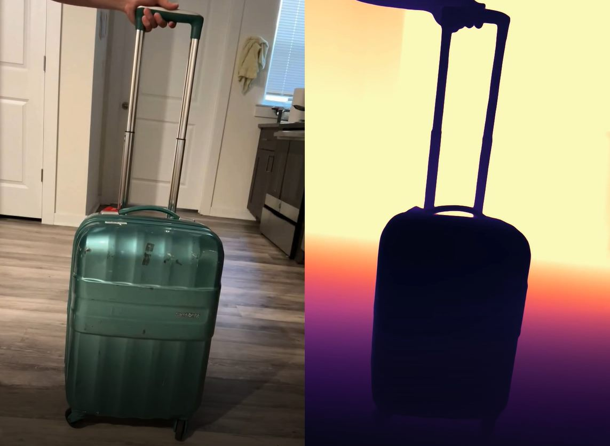
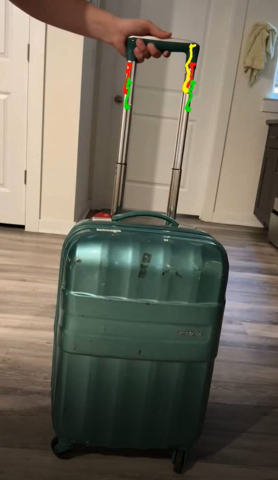

# NovaFlow: Actionable Object Flow Generation Pipeline

NovaFlow is an end-to-end monocular video pipeline that estimates depth, tracks persistent 3D points, grounds a target object from text, filters trajectories to that object, and renders final actionable flow visualizations.

## At A Glance

- Input: `inputs/my_video.mp4`
- Core stages: depth -> calibration -> tracking -> grounding -> actionable flow
- Main outputs:
  - `outputs/step1_depth/`
  - `outputs/step3_tracking/`
  - `outputs/step5_final_flow/`

## Results Gallery

| Stage | Preview |
|---|---|
| Step 1: Depth estimation |  |
| Step 2: Calibrated depth |  |
| Step 3: 3D tracking |  |
| Step 4: Grounded object filtering |  |
| Step 5: Final actionable flow |  |
| Step 5: Final motion trails |  |

## Pipeline Steps

1. `step1_depth_estimation.py`: Monocular depth inference from `inputs/my_video.mp4`.
2. `step2_depth_calibration.py`: Metric calibration using known distance (`--dist`).
3. `step3_run_tracking.py`: TAPIP3D tracking using RGB + calibrated depth.
4. `step4_object_grounding.py`: Grounding DINO + SAM2 object grounding and track filtering.
5. `step5_visualize_flow.py`, `step5_visualize_trails.py`: Final flow rendering.

## Quick Start

```bash
python step1_depth_estimation.py
python step2_depth_calibration.py --dist 0.5
python step3_run_tracking.py
python step4_object_grounding.py
python step5_visualize_flow.py
python step5_visualize_trails.py
```

## Output Reference

### `outputs/step1_depth/`

- `raw_depth.npy`
- `depth_visualization.mp4`
- `calibrated_depth.npy`
- `calibrated_depth_viz.mp4` (if `step2_visualize.py` is used)

### `outputs/step3_tracking/`

- `inference_input.npz`
- `**/inference_input.result.npz` (or directly under `outputs/step3_tracking/`)
- `tracking_result_fixed.mp4` (if `step3_visualize.py` is used)

### `outputs/step5_final_flow/`

- `actionable_flow.npy`
- `final_actionable_flow.mp4`
- `final_flow_trails.mp4`

## Required Checkpoints

- `TAPIP3D/checkpoints/tapip3d_final.pth`
- `Grounded-SAM-2/checkpoints/groundingdino_swint_ogc.pth`
- `Grounded-SAM-2/checkpoints/sam2_hiera_large.pt`

## Notes

- Set object prompt in `step4_object_grounding.py` using `TEXT_PROMPT`.
- Projection intrinsics are currently fixed in scripts (`FX/FY/CX/CY`).

## Credits

- [Grounded-SAM-2](Grounded-SAM-2/)
- [TAPIP3D](TAPIP3D/)
